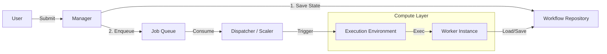

# Workflow Manager Proposal

## Overview

This document proposes an architectural expansion for the `deepnoodle/workflow` library. While the current library provides a robust, DAG-based execution engine for individual workflows, it lacks a supervisor layer to manage the lifecycle, persistence, and concurrency of *multiple* workflow executions in a production environment.

This proposal introduces a `WorkflowManager` (or `Engine`) to bridge the gap between the core execution logic and production requirements like crash recovery, bounded concurrency, and guaranteed persistence.

## Current State & Gaps

The current `Execution` struct manages a single workflow run.

| Feature | Current State | Gap |
| :--- | :--- | :--- |
| **Persistence** | `Checkpointer` saves state after activities. | No central registry of *all* executions. If the process dies, there is no mechanism to know *what* was running to resume it. |
| **Concurrency** | Unbounded goroutines per `Path`. | No global limit on concurrent workflows or activities, risking resource exhaustion. |
| **Submission** | In-memory `NewExecution`. | Submission is ephemeral until the first checkpoint. A crash immediately after submission loses the workflow. |
| **Retries** | Supported at `Step` level. | Excellent. No changes needed at the engine level, but the Manager should respect them. |

## Proposed Architecture

We propose a modular architecture separating **Persistence** (State), **Queueing** (Flow), and **Execution** (Compute).



### 1. Workflow Repository (State)
*Responsible for durable storage of workflow state (inputs, current step, variables).*
(Unchanged from previous section)

### 2. Job Queue (Flow)
*Responsible for reliable delivery of execution tasks to workers.*

We abstract the queuing mechanism to allow for different infrastructure choices.

```go
type JobQueue interface {
    // Enqueue adds a workflow ID to the execution queue.
    Enqueue(ctx context.Context, executionID string) error

    // Consume listens for jobs and calls the handler.
    // Implementations can use polling (Postgres) or push (Pub/Sub).
    Consume(ctx context.Context, handler func(ctx context.Context, executionID string) error) error
}
```

**Implementations:**
*   **`PostgresQueue`**: Uses a generic `queue` table with `status`, `next_run_at`, and `locked_by` columns. Supports `SKIP LOCKED` for safe polling.
*   **`PubSubQueue`**: Wraps Google Cloud Pub/Sub. `Enqueue` publishes a message; `Consume` subscribes to a subscription.

### 3. Execution Environment (Compute)
*Responsible for where and how the code actually runs.*

This interface allows us to scale execution from a single process to a serverless fleet.

```go
type ExecutionEnvironment interface {
    // SpawnWorker triggers the execution of a specific workflow.
    // It returns immediately once the work is scheduled/started.
    SpawnWorker(ctx context.Context, executionID string) error
}
```

**Implementations:**

#### A. `LocalExecutionEnvironment` (Development/Simple)
Spawns a goroutine for each job, limited by a local semaphore.

#### B. `SpritesExecutionEnvironment` (On-Demand / Serverless)
Utilizes [sprites.dev](https://sprites.dev) to spin up Firecracker VMs on demand.

*   **Configuration:** API Key, Sprite Template ID (pre-configured with the worker binary).
*   **Logic:**
    1.  `SpawnWorker` calls the Sprites `exec` API.
    2.  Command: `./worker --execution-id <id> --db-dsn <dsn>`
    3.  The Sprite wakes up (ms), runs the job, and hibernates automatically when done.

### 4. The Manager (Wiring it together)

The `Manager` acts as the composition root.

```go
type Manager struct {
    repo      WorkflowRepository
    queue     JobQueue
    env       ExecutionEnvironment
    // ...
}

func (m *Manager) StartDispatcher(ctx context.Context) error {
    // Connect the Queue to the Environment
    return m.queue.Consume(ctx, func(ctx context.Context, id string) error {
        // Trigger the environment to run the worker
        return m.env.SpawnWorker(ctx, id)
    })
}
```

## Detailed Design: Sprites.dev Integration

This architecture enables a powerful "Scale-to-Zero" pattern using Sprites.

1.  **Submission:**
    *   API calls `Manager.Submit(wf)`.
    *   Workflow saved to Postgres (Status=Pending).
    *   ID pushed to `PubSubQueue`.

2.  **Dispatch (The "Scaler"):**
    *   A lightweight, long-running process (e.g., a small k8s deployment or a "Service" Sprite) runs `Manager.StartDispatcher`.
    *   It consumes messages from Pub/Sub.
    *   For each message, it calls `Sprites.exec(...)`.

3.  **Execution:**
    *   The targeted Sprite wakes up.
    *   It runs the `worker` binary.
    *   Worker loads the workflow from Postgres.
    *   Worker runs to completion (or failure).
    *   Worker exits. Sprite hibernates.

**Benefits:**
*   **Isolation:** Each workflow run can be isolated in a VM.
*   **Cost:** Pay only for active execution time (plus storage).
*   **Simplicity:** No need to manage a complex k8s autoscaler for the workers.

## API Changes / Migration

*   **New Interfaces:** `JobQueue`, `ExecutionEnvironment`.
*   **Configuration:** `ManagerConfig` updated to accept these interfaces.


## detailed Design

## Detailed Design: Lifecycle

### 1. Submission (API Layer)

The submission process is now a two-step transaction (conceptually).

```go
func (m *Manager) Submit(ctx context.Context, workflow *Workflow, inputs map[string]any) (string, error) {
    id := NewExecutionID()
    
    // 1. Persist intent (Source of Truth)
    // Status = Pending
    err := m.repo.CreateWorkflow(ctx, id, ExecutionOptions{
        Workflow: workflow,
        Inputs:   inputs,
    })
    if err != nil {
        return "", fmt.Errorf("failed to persist workflow: %w", err)
    }

    // 2. Announce availability (Flow)
    // Even if this fails, a "sweeper" process can find Pending jobs later.
    if err := m.queue.Enqueue(ctx, id); err != nil {
        m.logger.Warn("failed to enqueue job, relying on sweeper", "id", id, "error", err)
    }

    return id, nil
}
```

### 2. Dispatching (Scaling Layer)

The Dispatcher connects the Queue to the Execution Environment. It does *not* execute the workflow code itself; it merely orchestrates *where* it runs.

```go
// StartDispatcher consumes from the queue and spawns workers.
func (m *Manager) StartDispatcher(ctx context.Context) error {
    return m.queue.Consume(ctx, func(ctx context.Context, id string) error {
        
        // Optional: Pre-check status from Repo to avoid spawning for cancelled jobs
        // ...

        // Trigger the environment
        // For 'Local', this starts a goroutine.
        // For 'Sprites', this makes an API call.
        if err := m.env.SpawnWorker(ctx, id); err != nil {
            return fmt.Errorf("failed to spawn worker: %w", err)
        }
        
        return nil
    })
}
```

### 3. Execution (Worker Layer)

The Worker is the binary process that actually runs the `Execution`. In the Sprites model, this process starts fresh inside the VM.

```go
// RunWorker is the entrypoint for the worker binary
func RunWorker(ctx context.Context, repo WorkflowRepository, executionID string) error {
    // 1. Claim/Lock the workflow (if not already handled by Queue)
    if err := repo.ClaimWorkflow(ctx, executionID, GetMachineID()); err != nil {
        return err // Already claimed
    }

    // 2. Load State
    // ...

    // 3. Resume/Run Execution
    // ...
    
    return nil
}
```

**Note on Trade-offs:**
*   **Workflow vs. Activity Concurrency:** Limiting *workflows* is simpler. Limiting *activities* (global worker pool for steps) is more efficient for I/O bound workloads but requires refactoring `Path.Run` to yield execution to a pool. Given the library uses goroutines per path, a "Workflow limit" is a good starting point.
*   **Queueing:** If the semaphore is full, `Submit` (via `process`) will block or just spawn a goroutine that blocks. For a robust system, we might want an explicit queue, but Go's scheduler + channels handles thousands of blocked goroutines well enough for moderate scale.

### Phase 3: Observability

The `Manager` should expose standard metrics or hooks.

```go
type ManagerCallbacks interface {
    OnWorkflowSubmitted(id string)
    OnWorkflowStarted(id string)
    OnWorkflowCompleted(id string, duration time.Duration, err error)
}
```

This allows users to hook in Prometheus/OpenTelemetry without adding a hard dependency to the library.

## API Changes / Migration

*   **No Breaking Changes:** The existing `Execution` and `Path` APIs remain untouched. Users can still run workflows manually if they wish.
*   **New Package/Struct:** `Manager` can live in the root `workflow` package or a `manager` subpackage.

## Implementation Plan

1.  Define `WorkflowRepository` interface.
2.  Implement `Manager` struct with `Submit`, `Start` (recovery), and `Shutdown`.
3.  Implement `FileWorkflowRepository` (extending the current file checkpointer idea) for easy testing.
4.  Add concurrency limits to `Manager`.

## Future Considerations

*   **Distributed Workers:** If multiple Manager instances run, they need a way to lock workflows so they don't double-execute. A `Lock(id)` method on the Repository would be needed.
*   **Cron/Scheduled Workflows:** The Manager could include a scheduler loop.
